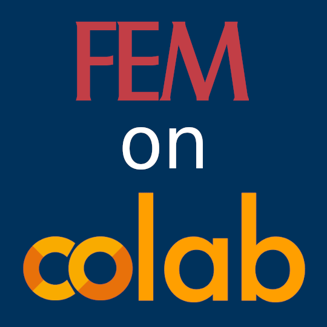

FEM on Colab
==============
.. meta::
    :description lang=en:
        FEM on Colab is a collection of packages that allows to easily install several finite element libraries on Google Colab.
        FEM on Colab is currently developed at Università Cattolica del Sacro Cuore by Prof. Francesco Ballarin.

.. image:: _static/images/github-logo.png
    :target: https://github.com/fem-on-colab/fem-on-colab
    :height: 80px
    :width: 80px
    :alt: Go to repository on GitHub

Description
-----------

**FEM on Colab** is a collection of packages that allows to easily install several finite element libraries on Google Colab.
Currently supported libraries are `FEniCS <https://bitbucket.org/fenics-project/dolfin>`__, `FEniCSx <https://github.com/FEniCS/dolfinx>`__, `firedrake <https://github.com/firedrakeproject/firedrake>`__ and `ngsolve <https://github.com/NGSolve/ngsolve>`__. Mesh generation via `gmsh <https://gitlab.onelab.info/gmsh/gmsh>`__ and `netgen <https://github.com/NGSolve/netgen>`__ is also supported.

Authors
------------------------

**FEM on Colab** is currently developed and maintained at `Università Cattolica del Sacro Cuore <https://www.unicatt.it/>`__ by `Prof. Francesco Ballarin <https://www.francescoballarin.it>`__.

Timeline and funding
------------------------
.. list-table::
   :widths: 10 90

   * - May 2021
     - Early development of **FEM on Colab** begins at `Università Cattolica del Sacro Cuore <https://www.unicatt.it/>`__.
   * - January 2022
     - End user packages are automatically built on a weekly basis, while their dependencies are built on a monthly basis.
   * - October 2022
     - Latest `backend information <https://github.com/googlecolab/backend-info>`__ reported by Google Colab developers is now used in the scheduled builds.
   * - November 2022
     - **FEM on Colab** has a new spin-off: learn more about `FEM on Kaggle <https://fem-on-kaggle.github.io>`__!
   * - December 2022
     - Small donations can now be sent through the `GitHub Sponsors <https://github.com/sponsors/francesco-ballarin>`__ program.

Learn more about FEM on Colab
-----------------------------
.. toctree::
    :maxdepth: 1

    packages
    advanced
    contributing
    citing
    publications

License
-------

**FEM on Colab** is freely available under the MIT license.
